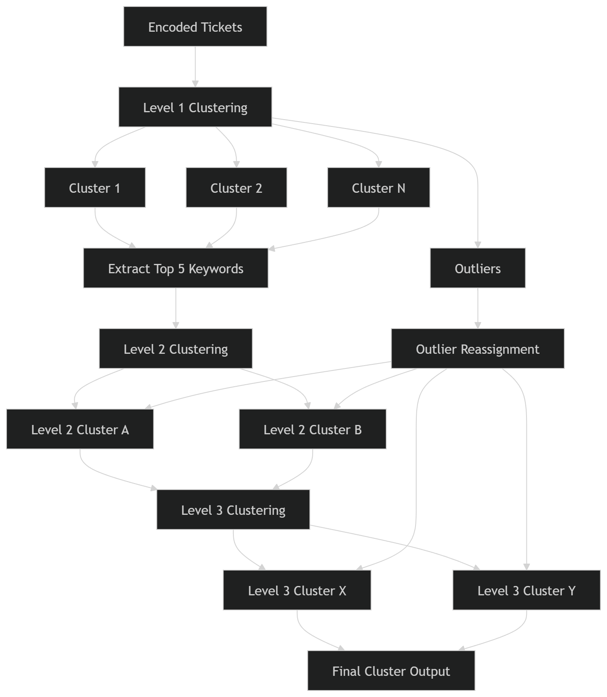

# **ServiceNow Ticket Clusterer**

A lightweight desktop application that clusters ServiceNow tickets using DistilRoBERTa embeddings and keyword-based hierarchical clustering.

The tool is designed for low-spec machines without GPU and can process hundreds to tens of thousands of tickets.

---

## Features

- Clusters ServiceNow tickets using semantic embeddings

- Multi-level clustering structure (Level 1 → Level 3)

- Automatic cluster naming using TF-IDF keywords

- Ignore-word customisation

- Simple GUI interface

- Supports Excel and CSV inputs

- Generates downloadable output files

---

## Supported Input Files

The application accepts the following formats:

- .csv

- .xlsx

- .xlsm

- .xltm

---

## Input Fields Used

The clustering process combines the following ServiceNow ticket fields:

- Short description

- Description

- Comments and Work notes

- Configuration Item

- Impacted Location

The following are removed during preprocessing:

- Agent names from *Assigned to*

- Numbers

- Special characters

- Custom ignore words

---

## Clustering Process



```
ServiceNow Export
        │
        ▼
Text Cleaning
(remove names, stopwords, ignore words)
        │
        ▼
Sentence Embedding
(DistilRoBERTa)
        │
        ▼
Level 1 Ticket Clustering
        │
        ▼
Keyword Extraction (TF-IDF)
        │
        ▼
Level 2 Cluster Grouping
        │
        ▼
Level 3 Cluster Grouping
        │
        ▼
Outlier Reassignment
        │
        ▼
Final Cluster Output
```

### Level 1 Clustering

1. Consolidate text from selected ServiceNow fields.

2. Clean text by removing:

   - Names

   - Special characters

   - Numbers

   - Ignore words

3. Encode ticket text using DistilRoBERTa embeddings.

4. Cluster tickets into Level 1 clusters.

Tickets that cannot be grouped are labeled Outliers.

### Level 1 Cluster Naming

Each Level 1 cluster is named using TF-IDF keyword frequency.

Cluster names consist of 5 keywords representing the most common terms in the cluster.

### Level 2 Clustering

Level 1 clusters are grouped into Level 2 clusters when they share:

- At least 3 keywords

### Level 3 Clustering

Level 2 clusters are grouped into Level 3 clusters when they share:

- At least 1 keyword

## Outlier Reassignment

Outliers are reassigned using keyword matching:

1. Attempt to match with a Level 1 cluster (≥3 shared keywords)

2. If unsuccessful, attempt Level 2 cluster (≥1 shared keyword)

Remaining unmatched tickets remain Outliers.

## Handling Unclustered Level 1 Clusters

Level 1 clusters without parent clusters are grouped into Level 3 clusters when:

- They share ≥1 keyword with a Level 3 cluster

Clusters that cannot be grouped remain standalone clusters.

---

## Final Output Structure
```
Net Clusters =
    Unclustered Level 1 Clusters
  + Unclustered Level 2 Clusters
  + Level 3 Clusters

Total Dataset =
    Net Clusters
  + Remaining Outliers
  ```

---

## Ignore Words

The application maintains a customisable list of ignore words.

These words are removed during preprocessing to prevent noise in clustering.

Examples include:
```
message
attachments
recipient
comments
ticket
issue
user
email
confidential
security
operations
```

You can edit the ignore word list directly from the application using:
```
Manage Ignore Words
```

---

## Installation (for development)

1. Go to https://bitbucket.org/internationalsoscorp/sntclusterer/src/master/.

2. Clone the repository.

3. Create a virtual environment. (Optional but recommended)
   ```
   python -m venv sntc-env
   ```

4. Activate the virtual environment.
   ```
   sntc-env\Scripts\activate
   ```
   
5. Ensure that `pip` is upgraded.
   ```
   python -m pip install --upgrade pip
   ```

6. Install packages.
   ```
   pip install -r requirements.txt
   ```
   OR
   ```
   pip install altgraph
   pip install certifi
   pip install charset-normalizer
   pip install click
   pip install colorama
   pip install contourpy
   pip install cycler
   pip install et_xmlfile
   pip install filelock
   pip install fonttools
   pip install fsspec
   pip install hdbscan
   pip install huggingface-hub
   pip install idna
   pip install Jinja2
   pip install joblib
   pip install kiwisolver
   pip install kneed
   pip install llvmlite
   pip install MarkupSafe
   pip install matplotlib
   pip install mpmath
   pip install networkx
   pip install nltk
   pip install numba
   pip install numpy
   pip install openpyxl
   pip install packaging
   pip install pandas
   pip install pefile
   pip install pillow
   pip install pyinstaller
   pip install pyinstaller-hooks-contrib
   pip install pynndescent
   pip install pyparsing
   pip install python-dateutil
   pip install pytz
   pip install pywin32-ctypes
   pip install PyYAML
   pip install regex
   pip install requests
   pip install safetensors
   pip install scikit-learn
   pip install scipy
   pip install seaborn
   pip install sentence-transformers
   pip install setuptools
   pip install six
   pip install sympy
   pip install threadpoolctl
   pip install tk
   pip install tokenizers
   pip install torch
   pip install tqdm
   pip install transformers
   pip install typing_extensions
   pip install tzdata
   pip install umap
   pip install umap-learn
   pip install urllib3
   pip install wheel
   ```

7. Go to https://huggingface.co/sentence-transformers/all-distilroberta-v1/tree/main.

8. Download everything in the main branch into the \\model\\all-distilroberta-v1 folder.

---

## Application Creation (for development)

1. To create the application as an executable file, run:
   ```
   python -m PyInstaller --noconfirm --onedir --windowed SNTClusterer_1.1.py
   ```
   Replace "SNTClusterer\_1.1.py" with the name of the .py file to be changed into an executable file.

   This generates a folder containing:
   ```
   ServiceNowTicketClusterer/
   ├─ ServiceNowTicketClusterer.exe
   ├─ _internal/
   └─ model/
   ```

   The _internal folder is hidden automatically by the application.

2. Use the folder inside the “dist” folder for usage and distribution purposes.

---

## Application Workflow

1. Launch the application

2. Click Choose File

3. Select a ServiceNow export file

4. Click Run Clustering

5. Monitor progress in the log window

6. Download output files when processing completes

---

## Performance Notes

1. Designed for CPU-only machines

2. Uses DistilRoBERTa, a compressed version of RoBERTa

3. Encoding step is the most time-consuming part

4. Large datasets (10k+ tickets) may produce hundreds of clusters

The multi-level clustering helps reduce cluster fragmentation and produce more meaningful groupings.

---

## Output

Generated cluster results are stored in the output folder.

You can:

Download individual files

Delete all output files from the GUI

---

## Version

v1.1

---

# Research & Methodology

This project explores multiple approaches to **automatically cluster and categorise ServiceNow incident tickets** using Natural Language Processing (NLP) and unsupervised machine learning.

The objective was to identify **recurring incident patterns**, reduce manual ticket triaging, and enable **automated classification of new tickets**.

---

# Problem Statement

Large IT service environments generate **tens of thousands of incident tickets** annually.
Manually reviewing and categorising these tickets is inefficient and inconsistent.

Key challenges include:

* identifying recurring issue patterns
* grouping semantically similar tickets
* handling large volumes of noisy text data
* generating meaningful cluster labels
* classifying new tickets into existing categories

The goal of this project was to design a system capable of:

* discovering **natural clusters of incident tickets**
* generating **interpretable cluster labels**
* supporting **future ticket classification**

---

# Dataset

The dataset consists of **ServiceNow incident tickets** exported from the ticketing system.

Relevant fields extracted from each ticket:

* **Short Description**
* **Description**
* **Comments and Work Notes**
* **Configuration Item**
* **Impacted Location**

These fields were combined to form a **single textual representation** of each ticket.

---

# Data Preprocessing

Raw ServiceNow tickets contain significant noise, including:

* agent signatures
* email artifacts
* system-generated text
* irrelevant metadata

The preprocessing pipeline performs the following steps:

### Text Cleaning

* remove punctuation
* remove special characters
* remove numbers
* remove stopwords
* remove agent names
* remove custom ignore-word list

### Text Normalization

* lowercase transformation
* whitespace normalisation

### Feature Representation

Two primary vectorisation approaches were evaluated:

| Method          | Description                                       |
| --------------- | ------------------------------------------------- |
| TF-IDF          | Traditional frequency-based vector representation |
| BERT embeddings | Semantic embeddings capturing contextual meaning  |

TF-IDF captures **word importance**, while BERT captures **semantic similarity between tickets**.

---

# Clustering Algorithms Evaluated

Several clustering algorithms were evaluated to determine the most effective approach for ticket grouping.

---

# K-Means Clustering

K-Means was the initial baseline algorithm used to identify clusters within the ticket embeddings.

### Advantages

* computationally efficient
* scalable for large datasets
* easy to interpret

### Challenges

* requires specifying the number of clusters (`k`)
* assumes spherical cluster structures

Selecting the optimal number of clusters was one of the main difficulties.

---

# Density-Based Clustering

Density-based methods were explored to automatically detect cluster structures and identify anomalies.

## DBSCAN

DBSCAN groups data points based on density and identifies outliers automatically.

### Observed Results

```
Clusters generated: 237
Outliers detected: 48,272 / 54,477 (88.61%)
```

Due to the extremely high outlier ratio, DBSCAN was unsuitable for this dataset.

---

## HDBSCAN

HDBSCAN improves on DBSCAN by supporting hierarchical density structures.

### Experimental Results

| min_cluster_size | clusters | outliers |
| ---------------- | -------- | -------- |
| 100              | 24       | 45,300   |
| 125              | 22       | 46,000   |
| 500              | 3        | 48,000   |

While HDBSCAN produced fewer clusters, the majority of tickets were still labeled as outliers.

---

# Gaussian Mixture Models (GMM)

Gaussian Mixture Models were explored to support **soft clustering**, allowing tickets to belong to multiple clusters with probabilities.

Cluster selection used **Bayesian Information Criterion (BIC)**.

### Result

The optimal cluster count consistently converged to the **upper bound of the tested range**, indicating poor model fit.

GMM was therefore not adopted.

---

# Determining the Optimal Number of Clusters

Selecting the correct cluster count is a common challenge in unsupervised learning.

Several evaluation techniques were explored.

---

## Elbow Method

The elbow method plots:

```
Sum of Squared Distances (SSD) vs Number of Clusters
```

The optimal `k` occurs where the curve begins to flatten.

However, this approach can be unreliable when clusters are not clearly separated.

---

## Silhouette Score

Measures how similar a ticket is to its own cluster compared to other clusters.

Higher values indicate better clustering quality.

---

## Additional Validation Metrics

Other internal validation metrics considered include:

* **Calinski-Harabasz Index**
* **Davies-Bouldin Index**

These metrics evaluate cluster cohesion and separation.

---

# Distance Metrics

Standard K-Means uses **Euclidean distance**, which assumes spherical clusters.

Alternative distance metrics explored include:

* **Cosine similarity**
* **Manhattan distance**
* **Mahalanobis distance**

Cosine similarity was particularly relevant for **text embedding vectors**.

---

# Cluster Label Generation

After clusters are formed, each cluster requires a **human-readable label** describing the incident category.

Several approaches were evaluated.

---

# Keyword-Based Labeling

## TF-IDF Keyword Extraction

Top keywords were extracted from each cluster using TF-IDF.

Cluster labels were generated using the **most frequent keywords**.

Example:

```
vpn access login authentication network
```

Advantages:

* simple
* interpretable
* deterministic

Limitations:

* limited semantic understanding

---

# Topic Modeling Approaches

## Latent Dirichlet Allocation (LDA)

LDA identifies hidden topics within a collection of documents.

Advantages:

* unsupervised
* scalable for large datasets

Limitations:

* requires specifying number of topics
* topics may be vague or overlapping

---

## BERTopic

BERTopic combines transformer embeddings with clustering to extract coherent topics.

Advantages:

* strong semantic understanding
* effective for short text

Limitations:

* computationally expensive

---

# LLM-Based Cluster Labeling

Large Language Models (LLMs) were considered for generating cluster summaries.

Example prompt:

```
Given these ticket descriptions, summarise the main issue in a few words.
```

Advantages:

* highly readable labels

Limitations:

* inconsistent outputs
* API costs
* non-deterministic behavior

---

# Hybrid Labeling Methods

The most promising approaches combine multiple techniques.

Examples:

* **TF-IDF + LLM refinement**
* **BERTopic + LLM summarisation**
* **Keyword extraction + statistical cluster analysis**

---

# Key Design Challenges

Several practical challenges were identified during development.

---

## Determining Cluster Count

Unsupervised clustering does not provide a clear answer for the optimal number of clusters.

---

## Outlier Handling

Density-based models produced extremely high outlier counts.

Questions considered:

* Should all tickets be forced into clusters?
* Should outliers be ignored?
* How should outliers be treated if they represent the majority?

---

## Cluster Naming

Cluster names must balance:

* interpretability
* consistency
* automation

Manual naming does not scale well for large datasets.

---

## Model Accuracy

Since clustering is unsupervised, evaluating accuracy is difficult.

A potential validation strategy is:

```
Training dataset: 2024 tickets
Evaluation dataset: 2025 tickets
```

Currently, the 2025 dataset is approximately **12% the size of the 2024 dataset**.

---

# Topic Quality Evaluation

Topic modeling quality can be evaluated using several metrics.

---

## Perplexity

Measures how well a probability model predicts unseen data.

Lower perplexity indicates better model performance.

---

## Topic Coherence

Measures semantic similarity between words within a topic.

| Score Range | Interpretation |
| ----------- | -------------- |
| 0.1 – 0.3   | Poor           |
| 0.3 – 0.5   | Average        |
| 0.5 – 0.7   | Good           |
| 0.7 – 0.9   | Very Good      |
| 0.9+        | Excellent      |

---

## Redundancy Score

Measures overlap between keywords across topics.

| Score Range | Interpretation      |
| ----------- | ------------------- |
| 0.0 – 0.3   | Low redundancy      |
| 0.3 – 0.6   | Moderate redundancy |
| 0.6 – 1.0   | High redundancy     |

---

# Future Work

Several enhancements are planned for future iterations of the project.

---

## Real-Time Ticket Classification

Deploy the model to automatically classify **incoming ServiceNow tickets**.

---

## ServiceNow API Integration

Direct integration with ServiceNow to enable:

* automated ticket categorisation
* incident trend monitoring
* early anomaly detection

---

## Automated Incident Taxonomy

Develop a hierarchical taxonomy such as:

```
Authentication Issues
    ├── Okta
    ├── BC Time Keeping
    └── Aspire
```

This enables **multi-level classification of incidents**.

---

## Continuous Model Improvement

Future improvements may include:

* periodic model retraining
* dynamic cluster updates
* automated detection of new incident categories
